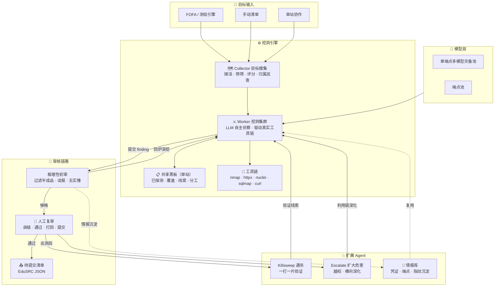
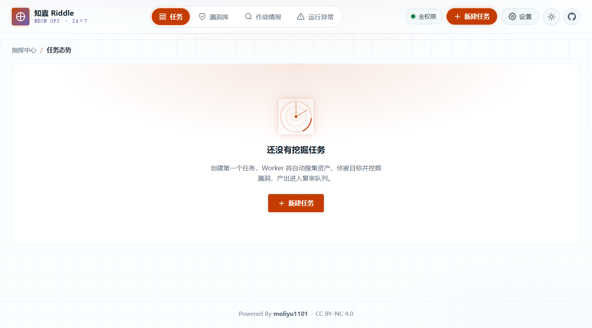
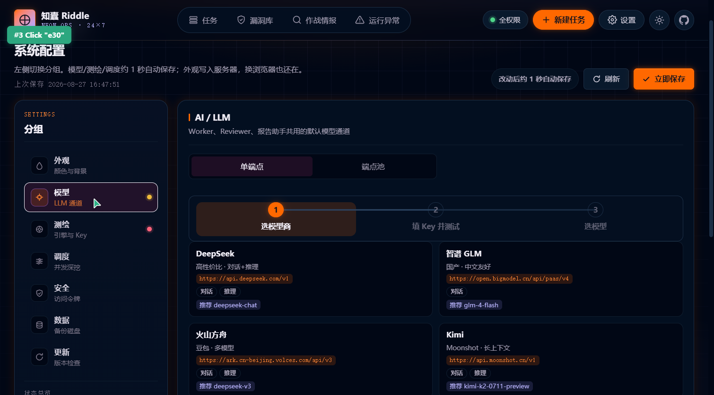
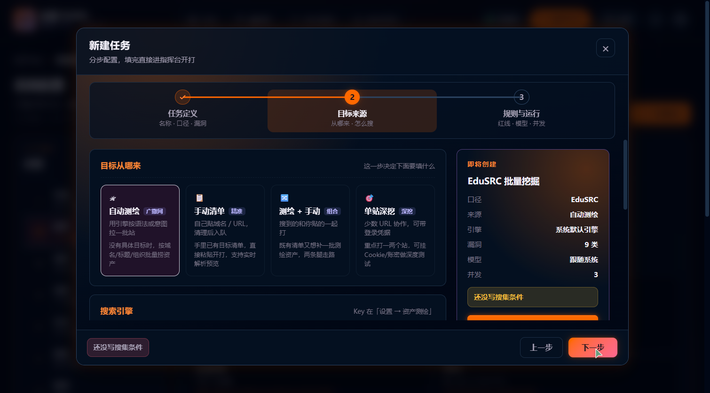
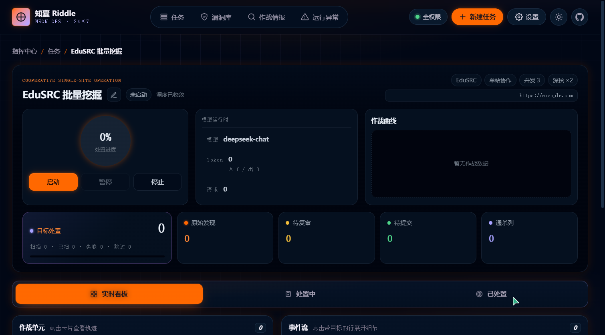
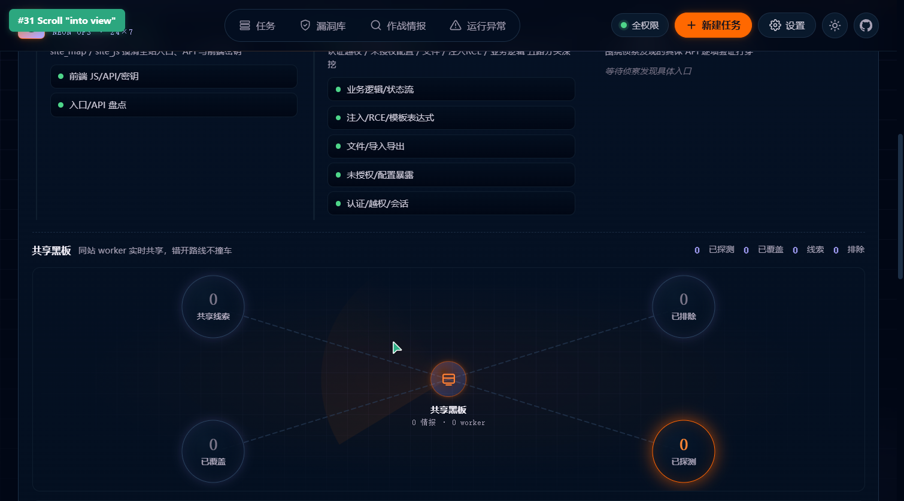

<div align="center">

<p align="center">
  
</p>

# 🐛 知蠹 Riddle

**多 Agent 协同 · 7×24 无人值守 · 人工只做复审决策**

> **二次开发声明**：知蠹 Riddle 基于开源项目 [AutoHunter](https://github.com/StanleyNull/AutoHunter)
> （作者 StanleyNull，CC BY-NC 4.0）二次开发，已获原作者授权，原署名保留。

[](LICENSE)


</div>

---

## 项目介绍

**知蠹 Riddle 是一个把大模型当作「侦察兵」的自动化漏洞挖掘平台。** 不是脚本批量扫，而是让 AI 自主决定打哪里、用什么工具、验证到什么程度才算实锤——平台用一整套流水线 Agent 管住 AI 的每一步，最后只把「能拿到实际危害证据」的洞交到你面前。

### 为什么需要它

传统自动化挖洞有两大痛点，Riddle 正是围绕它们设计：

- **误报满天飞**：脚本扫描把响应特征当漏洞，产出大量无效报告，人工审核成本极高。
- **只能扫已知模式**：传统扫描器按规则匹配，测不出业务逻辑漏洞、越权、状态机绕过这类「需要理解业务」的洞。

Riddle 的思路是**让 LLM 理解目标、自主决策、真实发包验证**。AI 会先侦察目标（页面、JS、API、入口），判断这是什么业务系统，再按业务逻辑去构造测试，最后用真实请求拿到响应作为证据——而不是凭响应关键字猜。

### 它的工作方式

你只管**定义目标和范围**，剩下的交给流水线：

1. **目标搜集** —— 从 FOFA / 手动清单 / 单站 持续产出目标，自动探活、预筛、按 IP/域名离线反查归属。
2. **逐个挖洞** —— 一个目标一个 Worker，AI 自主侦察 + 驱动真实工具链（nmap / httpx / nuclei / sqlmap / curl）深度测试。
3. **AI 初审** —— 极理性的 Reviewer 只认「实际可利用 + 实锤危害」，把半成品和误报过滤掉。
4. **人工复审** —— 你醒来花几分钟做最终裁决：调级别、通过、打回、编辑、标记提交。

你只做一件事——**复审**。剩下 7×24 小时，机器替你盯着目标。

---

## 系统架构



> 模型层默认走「单端点多模型灾备池」：同一供应商选多个模型，主模型不可用自动顶替；也可切「端点池」多供应商调度。Worker 的所有请求都经过内置规则约束（8 类危险操作硬拦截、SSRF 出网守卫、WAF）。

| Agent | 干什么 |
|---|---|
| 🗺️ 目标搜集 | 从 FOFA / 手动清单 / 单站持续产出目标，探活、预筛、评分、离线反查归属 |
| ⚔️ 挖洞 Worker | 一个目标一个 Worker，AI 自主侦察 + 驱动真实工具链（nmap/httpx/nuclei/sqlmap/curl）挖洞 |
| 📋 共享黑板 | 单站协作时多个 Worker 实时共享情报，错开路线不撞车 |
| 🧪 AI 初审 | 极理性过滤，只认「实际可利用 + 实锤危害」，够格才送人工 |
| 💥 通杀 Hunter | 出一个洞后，分析能否一打一片，实锤多个同款站点 |
| 🧠 情报沉淀 | 验证过的凭证/端点/指纹入全局情报库，后续 Worker 直接复用 |

你在控制台实时看每个 Worker 打到哪里、出了什么洞，目标优先级、事件流一目了然。

---

## 单站协作

面对**少数几个目标、要挖得深**的场景（比如手里就一个教育站点要仔细过一遍），Riddle 有专门的单站协作模式：一个站点派 **7 条固定路线**并发抢 worker，每条路线是一个独立 Worker，聚焦一类攻击面，靠「共享黑板」实时互通情报、自动错开不撞车。

### 开局并发路线

| 阶段 | 路线 | 聚焦 |
|---|---|---|
| **侦察盘点** | 入口/API 盘点 | 建全站入口与 API 清单：robots / sitemap / API 文档 / 前端路由 / 隐藏后台 / 非标路径 |
| | 前端 JS/API/密钥 | JS 审计挖接口、token、对象存储、隐藏管理路由、未授权 API、硬编码密钥 |
| **主题深挖** | 认证/越权/会话 | 登录、SSO/CAS、会话维持、IDOR、水平/垂直越权、默认口令、弱验证码 |
| | 未授权/配置暴露 | Swagger / Actuator / Nacos / Druid / .git / .env / 备份 / 日志 / 调试端点 |
| | 文件/导入导出 | 上传、附件、导入导出、模板下载、任意文件读/覆盖、路径穿越、解析执行 |
| | 注入/RCE/模板表达式 | SQL / NoSQL / 命令 / 模板 / 表达式 / 反序列化 / RCE，优先参数明确的 API |
| | 业务逻辑/状态流 | 注册、审批、支付、报名、验证码、重放、状态流绕过、敏感写操作 |
| **定向追打** | 定向 API 追打 | 前序 Worker 发现的高价值 API/路径，逐项收敛验证，不再泛泛侦察 |

> 侦察路线（site_map / site_js）优先跑、先铺开攻击面；主题深挖五条路线开局即并发抢 worker，不用苦等侦察跑完；出现强线索时，Worker 通过 `deepen_lead` 自动拉起「定向追打」接力深挖。

### 共享黑板机制

同站 7 个 Worker 通过任务级黑板实时共享四类情报：

- **已探测**：哪些 URL 有人试过了，结果如何，别重复打
- **已覆盖**：哪些入口已覆盖、结论是什么、还剩哪些盲区值得分配
- **共享线索**：发现的高价值 API / 接口 / 疑似漏洞，可信度标注（高/中/低）
- **已排除**：验证过打不穿的方向，标记排除避免再浪费时间

黑板只做「镜子」不做「锁」——只共享情报、不限制任何 Worker 发请求，靠共享信息让 AI 自主错开方向。控制台的「共享黑板态势图」以雷达图实时呈现四类情报分布，点击某条路线即可联动查看该路线的贡献与当前分工。

> **tip**：若已带登录凭据、或已明确要打哪些接口，可在任务向导勾选「跳过入口盘点侦察（省 LLM 调用与流量）」——只跳过 site_map，site_js 前端密钥价值高仍保留。

---

## 界面速览

控制台首页实时呈现任务态势；在设置页统一配置模型的 LLM 通道（同一供应商可勾选多个模型做灾备调度）；新建任务用三步向导一步步定义目标与规则。

<p align="center">
  
  <br>
  <sub>控制台首页 · 实时看板与任务入口</sub>
</p>

<p align="center">
  
  
  <br>
  <sub>左：设置页 LLM 模型配置 · 右：新建任务三步向导</sub>
</p>

<p align="center">
  
  <br>
  <sub>单站协作任务看板 · 协作态势 + 作战单元 + 事件流</sub>
</p>

<p align="center">
  
  <br>
  <sub>共享黑板 · 同站 worker 实时共享情报，错开路线不撞车</sub>
</p>

---

## 相比 AutoHunter 改进了什么

在 AutoHunter 基础上，Riddle 重点加厚了**协作、工具、质量、安全、前端**五层能力:

### 🤝 协作与调度

| 能力 | 说明 |
|---|---|
| **单站协作 + 黑板机制** | 单站任务多个 Worker 实时共享「已探测 / 已覆盖 / 线索 / 排除」，自动错开路线不撞车，可联动查看某条路线的实时情报 |
| **单端点多模型灾备** | 同一供应商下选多个模型，主模型不可用自动按灾备池顶替；「跟随系统」的任务同样生效 |
| **断点恢复** | LLM 异常 / 切换后，携带已探测过的 URL、会话态续挖，不从头再来 |

### 🛠️ 工具增强

| 能力 | 说明 |
|---|---|
| **真·终端 `run_shell`** | 工作目录与环境变量跨命令持久化、历史去重、超大输出自动摘要，还能随断点保存状态续跑 |
| **路径爆破 `path_probe`** | 常规字典 + 备份/源码泄露探测，用内容特征关键词判定命中，防误报，限量限速 |
| **注入探针 `injection_probe`** | CORS / SSRF / 命令注入 / SSTI / XXE 五类只读探测，安全不落盘、限量限速 |
| **全套挖洞工具** | 除基础的 HTTP / Shell 外，还有 JS 分析、解码、资产发现、指纹、弱口令、登录态、批量请求、差异对比、耗时测量、链接抓取、SQLi 探测、上传探测、权限边界、存证快照、已知漏洞验证等 20+ 工具 |
| **真实工具链** | nmap / httpx / nuclei / sqlmap / whatweb 容器内置，LLM 真实发包/执行 |

### 🧠 挖洞质量

| 能力 | 说明 |
|---|---|
| **差异化评分** | 从类型 + 目标 + 证据三维给漏洞打分，一眼区分「大众洞」与「业务逻辑 / 越权」稀缺洞，前端彩色徽章实时展示 |
| **业务画像 + 状态机引导** | 识别 18 类业务，注入 7 类多步业务流程的绕过手法，AI 会按业务逻辑去测 |
| **利用链引导** | 9 类漏洞模板的实锤标准 + 深化路线，逼 AI 先深挖再提交，把半成品拦下来 |
| **AI 极理性初审** | Reviewer 只认「实际可利用 + 实锤危害」，自动过滤重复 / 无效 / 证据不足 / 超范围 / 半成品 |
| **通杀 Hunter + 扩大危害** | 出一个洞后自动分析能否一打一片（Killsweep），并对高危洞做扩大危害（Escalate）深化利用 |
| **情报库沉淀** | 验证过的凭证 / 端点 / 指纹入全局情报库，后续 Worker 直接复用，越挖越聪明 |

### 🛡️ 规则限制与安全

| 能力 | 说明 |
|---|---|
| **八大类硬拦截规则** | guard 层对脱库/拖库/删库、删除数据、写入篡改、清缓存、改密重置凭证、爆破暴力破解、压测/DoS、webshell/后门共 8 类危险操作做硬拦截，HTTP 请求与 shell 命令双重守卫 |
| **SSRF 出网守卫** | 封禁内网地址 / 云元数据等敏感出网目标，防止 Worker 打到内网 |
| **内置 WAF** | 拦截公网常见扫描、注入、路径穿越、异常 Header、方法滥用、超大请求体、高频请求，可开关可调阈值 |
| **三级访问令牌** | 全权限 / 只读 / 观摩 三级角色令牌，观摩者只能看运行概况、看不到敏感证据 |
| **教育域名范围控制** | 内置高校域名锚点与教育资产识别，帮助把 Worker 锁定在授权教育资产内 |
| **只读优先原则** | 企业模式下 Worker 对生产数据只读验证、不写入篡改，弱口令点到为止 |

### 🎨 前端改进

| 能力 | 说明 |
|---|---|
| **事件流中文格式化** | 60+ 种事件类型全部映射为中文描述（LLM 错误/重试/断点恢复/通杀各阶段等），不再显示英文 raw kind |
| **六套主题预设** | 霓虹终端 / 赛博朋克 / 冰蓝管制 / 矩阵绿 / 琥珀暖夜 / 赤红警戒，一键切换主色与辉光 |
| **任务态势图** | 三阶段流水线（侦察盘点→主题深挖→定向追打）+ 阶段节点状态，一眼看清任务进行到哪 |
| **作战矩阵 + 轨迹抽屉** | 多 Worker 矩阵视图，点击任意 Worker 可展开完整轨迹（LLM 轮次 / 工具调用 / 认知更新） |
| **黑板协作面板** | 共享黑板态势图（雷达扫描 + 情报节点），点路线联动查看该路线情报 |
| **新建任务三步向导** | 任务定义 → 目标来源 → 规则与运行，分步配置、实时摘要、防误操作 |
| **设置页九大分区** | 外观 / 模型 / 测绘 / 调度 / 安全 / 数据 / 更新 / 工作目录 / 服务集成，全部可视化配置 |
| **模型商向导** | 选模型商 → 填 Key 并测试 → 选模型 三步引导，端点池可视化编辑，温度推荐 |

---

## 快速开始

需要一台装得下 Docker 的机器（生产推荐 Linux，2C4G 起，磁盘 ≥ 20G）。

```bash
# 1. 拉代码
git clone https://github.com/moliyu1101/Riddle.git && cd Riddle

# 2. 配置并启动
cp .env.example .env            # 至少填 LLM_API_KEY，见 .env.example 里的注释
docker compose up -d --build

# 3. 看日志直到就绪
docker compose logs -f riddle
```

首次构建会编译前端并安装挖洞工具链，约 **5–15 分钟**。之后就绪后访问 `http://<服务器IP>:18800/`。

> **首次进入的令牌是什么？**
>
> - **没配任何令牌 → 无需令牌，直接进入**（默认拥有全权限，可读写、启停任务、复审）。
> - **配了 `RIDDLE_API_TOKEN` → 用它的值作为令牌登录**（浏览器首次访问会弹出令牌输入框，填入即获得 full 全权限）。
> - 令牌优先级：**设置页「安全」里自定义的令牌 > 环境变量**。设置页可以分别配置全权限 / 只读 / 观摩 三个令牌，只读令牌禁止一切写操作、观摩令牌只能看运行概况。
> - 公网部署**务必**设置 `RIDDLE_API_TOKEN`，否则任何人可访问你的控制台。
> - 忘记令牌？去 `.env` 改 `RIDDLE_API_TOKEN` 后重启容器即可。

> 国内网络若 apt/pip 拉取超时，Dockerfile 已内置清华镜像兜底；Docker Desktop 拉基础镜像慢时自配 mirror。

---

## 需要配置什么

最少只要一个 **LLM API Key**（`LLM_API_KEY`，DeepSeek/OpenAI/Claude/通义等都能接）。其他都有合理默认:

| 变量 | 说明 |
|---|---|
| `LLM_API_KEY` | **必填**，大模型 API Key（DeepSeek/OpenAI/Claude/通义等） |
| `LLM_BASE_URL` / `LLM_MODEL` / `LLM_PROTOCOL` | 模型端点，默认 DeepSeek Compatible（`deepseek-chat`） |
| `FOFA_KEY` | 想用 FOFA 自动搜目标才需要 |
| `RIDDLE_API_TOKEN` | 控制台登录令牌，**公网部署务必设置**，否则对全网裸奔 |
| `RIDDLE_HOST_PORT` | 对外端口，默认 18800 |

Key 也可以不填 `.env`，直接在控制台「设置」页填进数据库——优先级更高，多机部署更灵活。

---

## 常用运维

```bash
docker compose up -d --build    # 更新后重建
docker compose restart riddle   # 重启
docker compose down             # 停止（数据留在 volume）
docker compose logs -f riddle   # 实时日志
```

- **数据存哪**：Docker volume `ah_data`（SQLite + 证据）、`ah_work`（Worker 工作区），升级重启不丢。
- **备份**：设置页「数据备份」导出一致快照并恢复。别直接 `cp riddle.db`——WAL 模式拷半截库会坏。
- **续跑**：`RIDDLE_RESTORE_ON_STARTUP=1` 时重启会自动续跑之前进行中的任务。

---

## ⚠️ 免责声明

**在使用知蠹 Riddle 之前，请务必完整阅读以下条款。**

### 授权边界
- **仅限对已获明确书面授权的目标使用。** 本工具设计用于授权的安全测试、渗透测试、CTF 竞赛、SRC 漏洞挖掘等合规场景。
- 未获授权对任何系统、网络、应用进行测试均属违法行为，由使用者自行承担全部法律责任。
- 使用 FOFA 等测绘引擎时，务必用域名 / 证书 / org 等条件**收窄归属范围**，避免打到范围外资产。

### 技术风险
- 本工具依赖大模型（LLM）自主决策，AI 的行为存在**不可完全预测性**——包括但不限于：请求目标出乎意料、误报漏报、在极端情况下自主产生写操作等。
- 本工具内置了删除限制等防护，但仍**不可能 100% 保证**在所有外部情况下（如模型自主意愿、目标反制、配置失误）不对数据造成修改或删除。
- Worker 由大模型驱动，会真实发包、执行真实工具链。请在完全了解其行为的前提下使用。

### 合规声明
- 本工具遵循 **CC BY-NC 4.0** 许可，**禁止任何商业用途**，禁止用于任何违法或恶意活动。
- 本项目为 **Demo 级别**，仅供参考学习与二次开发。使用中遇到的问题欢迎提 Issue，但**请勿归咎于原作者或本项目团队**。
- 使用即视为你已理解并同意以上全部条款，且自行承担使用本工具带来的一切后果。

---

## 技术栈

后端 Python 3.12 + FastAPI + SQLite；前端 Vue 3 + Vite；模型走 OpenAI/Anthropic 兼容接口（支持 tool calling，哑模型可用 `RIDDLE_TOOL_COMPAT=prompt` 模拟）；多测绘引擎（FOFA / Quake / Censys / Hunter）；容器内置 nmap / httpx / nuclei / sqlmap / whatweb。

---

<div align="center">

**Powered By StanleyNull**（AutoHunter 原作者）· 二次开发：知蠹 Riddle

*仅供授权安全测试与研究 · 请遵守当地法律法规*

</div>
