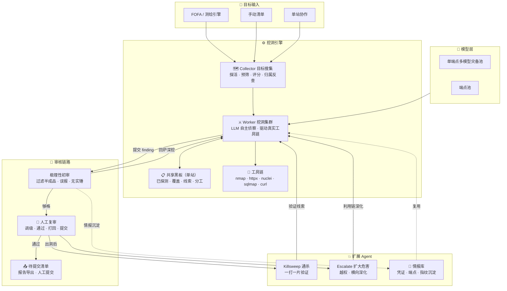
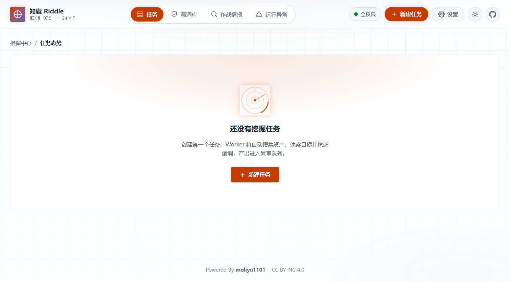
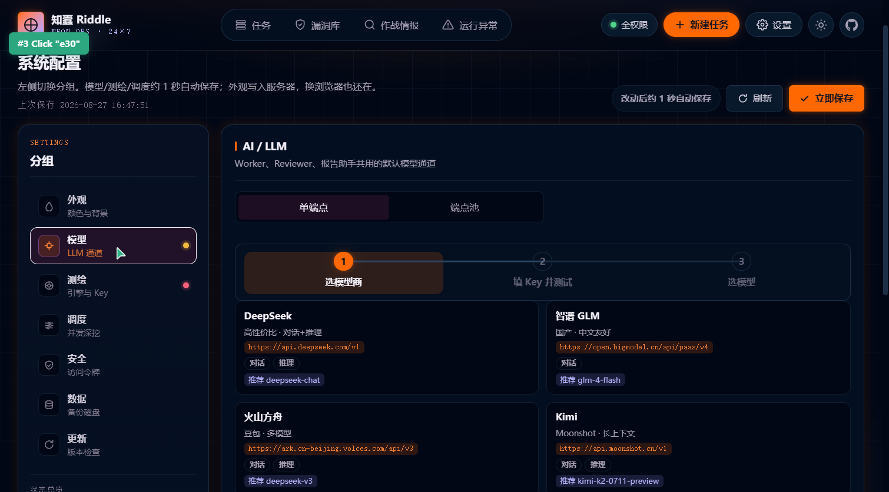
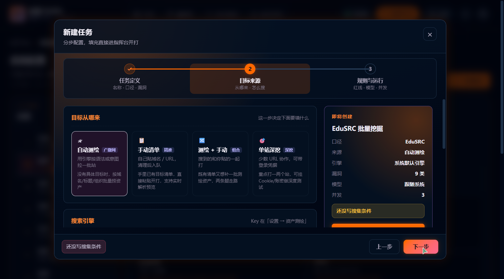
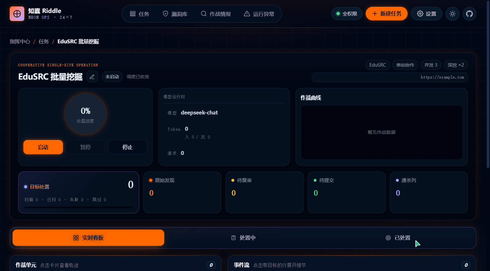
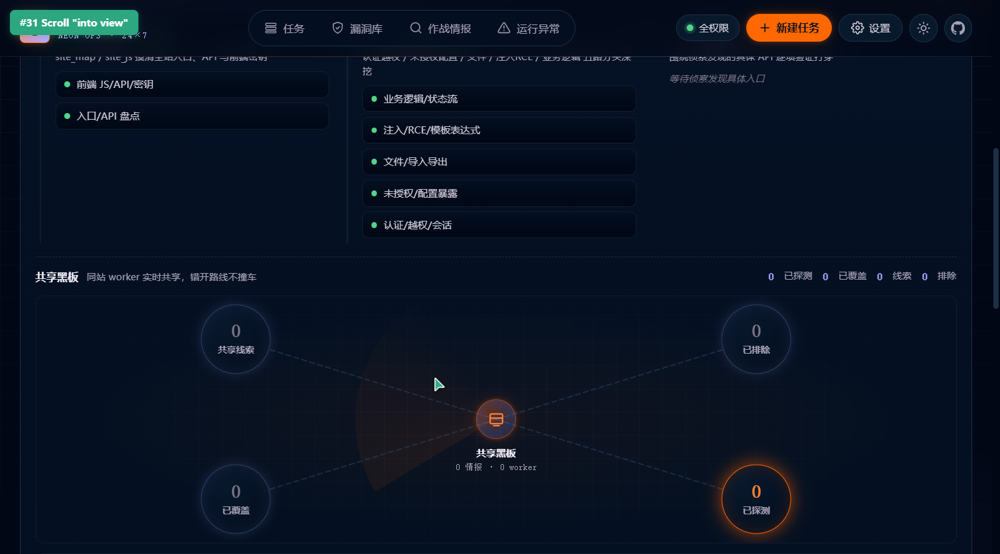

<div align="center">

<p align="center">
  
</p>

# 🐛 知蠹 Riddle

**把大模型当作「侦察兵」的自动化漏洞挖掘平台 · 多 Agent 协同 · 7×24 无人值守 · 人工只做复审决策**

[](LICENSE)


</div>

---

## 它解决什么问题

传统自动化挖洞的两个老毛病：**误报满天飞**（把响应特征当漏洞，人工审核成本极高）和**只能扫已知模式**（业务逻辑、越权、状态机绕过这类需要理解业务的洞根本测不到）。

Riddle 的做法：**让 LLM 理解目标、自主决策、真实发包验证**。AI 先侦察目标（页面 / JS / API / 入口），判断这是什么业务系统，再按业务逻辑构造测试，最后用真实请求拿到响应作为证据——只把「能拿到实际危害证据」的洞交给你。

## 工作方式

你只管定义目标和范围，剩下的交给流水线：

1. **目标搜集** —— 从 FOFA / 手动清单 / 单站持续产出目标，自动探活、预筛、按 IP/域名离线反查归属。
2. **逐个挖洞** —— 一个目标一个 Worker，AI 自主侦察 + 驱动真实工具链（nmap / httpx / nuclei / sqlmap / curl）深度测试。
3. **AI 初审** —— 极理性 Reviewer 只认「实际可利用 + 实锤危害」，把半成品和误报拦回去。
4. **人工复审** —— 你花几分钟做最终裁决：调级别、通过、打回、编辑、标记提交。


```mermaid
flowchart TD
    subgraph IN["🎯 目标输入"]
        direction LR
        F["FOFA / 测绘引擎"]
        M["手动清单"]
        S["单站协作"]
    end

    subgraph ENG["⚙️ 挖洞引擎"]
        direction TB
        COL["🗺️ Collector 目标搜集<br/>探活 · 预筛 · 评分 · 归属反查"]
        WORK["⚔️ Worker 挖洞集群<br/>LLM 自主侦察 · 驱动真实工具链"]
        BB["📋 共享黑板（单站）<br/>已探测 · 覆盖 · 线索 · 分工"]
        TOOL["🔧 工具链<br/>nmap · httpx · nuclei · sqlmap · curl"]
    end

    subgraph MLLM["🧠 模型层"]
        direction LR
        P1["单端点多模型灾备池"]
        P2["端点池"]
    end

    subgraph RV["🧪 审核链路"]
        direction LR
        R1["极理性初审<br/>过滤半成品 · 误报 · 无实锤"]
        R2["👤 人工复审<br/>调级 · 通过 · 打回 · 提交"]
        R3["📤 待提交清单<br/>报告导出 · 人工提交"]
    end

    subgraph ADV["💥 扩展 Agent"]
        direction LR
        K["Killsweep 通杀<br/>一打一片验证"]
        E["Escalate 扩大危害<br/>越权 · 横向深化"]
        I["🧠 情报库<br/>凭证 · 端点 · 指纹沉淀"]
    end

    F --> COL
    M --> COL
    S --> COL
    COL --> WORK
    WORK <--> BB
    WORK --> TOOL
    MLLM --> WORK
    WORK -->|提交 finding| R1
    R1 -->|够格| R2
    R1 -->|回炉深挖| WORK
    R2 -->|通过| R3
    R2 -->|出洞后| K
    K -->|验证线索| WORK
    R2 --> E
    E -->|利用链深化| WORK
    R1 -.情报沉淀.-> I
    I -.复用.-> WORK
```

## 核心能力

### 挖洞质量

| 能力 | 说明 |
|---|---|
| **AI 极理性初审** | 只认「实际可利用 + 实锤危害」，自动过滤重复 / 无效 / 证据不足 / 超范围 / 半成品 |
| **差异化评分** | 从类型 + 目标 + 证据三维打分，一眼区分「大众洞」与「业务逻辑 / 越权」稀缺洞 |
| **业务画像 + 状态机引导** | 识别 18 类业务，注入多步业务流程的绕过手法，AI 按业务逻辑去测 |
| **利用链引导** | 9 类漏洞模板的实锤标准 + 深化路线，逼 AI 先深挖再提交 |
| **通杀 Hunter + 扩大危害** | 出一个洞后自动分析能否一打一片，并对高危洞深化利用 |
| **情报库沉淀** | 验证过的凭证 / 端点 / 指纹入全局情报库，后续 Worker 直接复用，越挖越聪明 |

### 工具与调度

| 能力 | 说明 |
|---|---|
| **20+ 挖洞工具** | HTTP / Shell 之外还有 JS 审计、资产发现、指纹、弱口令、登录态、SQLi 探测、上传探测、权限边界、存证快照、已知漏洞验证等 |
| **真实工具链** | nmap / httpx / nuclei / sqlmap / whatweb 容器内置，LLM 真实发包执行 |
| **真·终端 run_shell** | 工作目录与环境变量跨命令持久化、超大输出自动摘要、随断点续跑 |
| **多模型灾备** | 单端点多模型灾备池 / 多供应商端点池，主模型不可用自动顶替；断点恢复续挖不从头再来 |
| **多测绘引擎** | FOFA / Quake / Censys / Hunter / Shodan / ZoomEye，查询语法自动适配 |

### 安全边界

| 能力 | 说明 |
|---|---|
| **任务级危险操作硬拦截** | 删库 / 清缓存 / 改密等破坏性操作默认拦截，任务里还可勾选 8 类额外收紧 |
| **SSRF 出网守卫** | 封禁内网地址 / 云元数据等敏感出网目标，防 Worker 打到内网 |
| **内置 WAF** | 拦公网常见扫描 / 注入 / 路径穿越 / 异常 Header / 超大请求体，可开关可调阈值 |
| **三级访问令牌** | 全权限 / 只读 / 观摩，观摩者只看运行概况、看不到敏感证据 |
| **范围控制** | 教育域名锚点锁定授权资产；企业模式对生产数据只读验证、弱口令点到为止 |

### 控制台

| 能力 | 说明 |
|---|---|
| **作战矩阵 + 轨迹抽屉** | 多 Worker 矩阵视图，点开任意 Worker 看完整轨迹（LLM 轮次 / 工具调用 / 认知更新） |
| **任务态势图** | 三阶段流水线 + 阶段节点状态，一眼看清挖到哪 |
| **事件流中文格式化** | 60+ 种事件类型全部映射中文描述 |
| **六套主题预设** | 霓虹终端 / 赛博朋克 / 冰蓝管制 / 矩阵绿 / 琥珀暖夜 / 赤红警戒，一键切换 |
| **三步任务向导 + 九分区设置** | 任务定义 → 目标来源 → 规则运行；模型 / 测绘 / 安全 / 数据全可视化配置 |

## 单站协作

面对**少数目标、挖深**的场景（比如手里一个教育站点要仔细过一遍），单站协作模式给一个站点派 **7 条固定路线**并发抢 Worker，每条路线聚焦一类攻击面，靠「共享黑板」实时互通情报、自动错开不撞车：

| 阶段 | 路线 | 聚焦 |
|---|---|---|
| **侦察盘点** | 入口/API 盘点 · 前端 JS/密钥 | 全站入口与 API 清单；JS 审计挖接口 / token / 隐藏路由 / 硬编码密钥 |
| **主题深挖** | 认证/越权 · 未授权/配置暴露 · 文件/导入导出 · 注入/RCE · 业务逻辑/状态流 | 登录与 SSO、IDOR 与越权、Swagger/Actuator/.env 暴露、上传与穿越、注入与反序列化、支付/审批/重放等业务流 |
| **定向追打** | 定向 API 追打 | 前序 Worker 发现的高价值 API 逐项收敛验证 |

黑板只做「镜子」不做「锁」——四类情报（已探测 / 已覆盖 / 共享线索 / 已排除）实时共享，靠信息让 AI 自主错开方向，不限制任何 Worker 发请求。看板以雷达图实时呈现情报分布，点路线联动查看贡献与分工。

> **tip**：已带登录凭据或明确要打的接口，可在任务向导勾选「跳过入口盘点侦察」省 LLM 调用与流量（site_js 前端密钥价值高仍保留）。

## 界面速览

控制台首页实时呈现任务态势；在设置页统一配置模型的 LLM 通道（同一供应商可勾选多个模型做灾备调度）；新建任务用三步向导一步步定义目标与规则。

<p align="center">
  
  <br>
  <sub>控制台首页 · 实时看板与任务入口</sub>
</p>

<p align="center">
  
  
  <br>
  <sub>左：设置页 LLM 模型配置 · 右：新建任务三步向导</sub>
</p>

<p align="center">
  
  <br>
  <sub>单站协作任务看板 · 协作态势 + 作战单元 + 事件流</sub>
</p>

<p align="center">
  
  <br>
  <sub>共享黑板 · 同站 worker 实时共享情报，错开路线不撞车</sub>
</p>

## 快速开始

需要一台装得下 Docker 的机器（生产推荐 Linux，2C4G 起，磁盘 ≥ 20G）。

```bash
git clone https://github.com/moliyu1101/Riddle.git && cd Riddle
cp .env.example .env            # 至少填 LLM_API_KEY，见 .env.example 里的注释
docker compose up -d --build
docker compose logs -f riddle
```

首次构建会编译前端并安装挖洞工具链，约 **5–15 分钟**。就绪后访问 `http://<服务器IP>:18800/`。

> **首次进入的令牌是什么？**
>
> - **没配任何令牌 → 无需令牌直接进入**（默认全权限）。
> - **配了 `RIDDLE_API_TOKEN` → 用它的值登录**（首次访问弹出令牌输入框，填入即获得 full 全权限）。
> - 令牌优先级：设置页「安全」里自定义的令牌 > 环境变量；设置页可分别配置全权限 / 只读 / 观摩三个令牌。
> - 公网部署**务必**设置 `RIDDLE_API_TOKEN`，否则任何人可访问你的控制台。
> - 忘记令牌？去 `.env` 改 `RIDDLE_API_TOKEN` 后重启容器即可。

> 国内网络 apt/pip 拉取超时，Dockerfile 已内置清华镜像兜底；Docker Desktop 拉基础镜像慢时自配 mirror。

## 需要配置什么

最少只要一个 **LLM API Key**，其他都有合理默认：

| 变量 | 说明 |
|---|---|
| `LLM_API_KEY` | **必填**，大模型 API Key（DeepSeek / OpenAI / Claude / 通义等都能接） |
| `LLM_BASE_URL` / `LLM_MODEL` / `LLM_PROTOCOL` | 模型端点，默认 DeepSeek Compatible（`deepseek-chat`） |
| `FOFA_KEY` | 想用 FOFA 自动搜目标才需要 |
| `RIDDLE_API_TOKEN` | 控制台登录令牌，**公网部署务必设置** |
| `RIDDLE_HOST_PORT` | 对外端口，默认 18800 |

Key 也可以不填 `.env`，直接在控制台「设置」页填进数据库——优先级更高，多机部署更灵活。

## 常用运维

```bash
docker compose up -d --build    # 更新后重建
docker compose restart riddle   # 重启
docker compose down             # 停止（数据留在 volume）
docker compose logs -f riddle   # 实时日志
```

- **数据存哪**：Docker volume `riddle_data`（SQLite + 证据）、`riddle_work`（Worker 工作区），升级重启不丢。别直接 `cp riddle.db`——WAL 模式拷半截库会坏，用设置页「数据备份」导出一致快照。
- **从旧版本升级（数据卷改名）**：卷名由 `ah_data`/`ah_work` 改为 `riddle_data`/`riddle_work`，升级前迁移一次旧数据：

  ```bash
  docker run --rm -v ah_data:/src -v riddle_data:/dst alpine sh -c "cp -a /src/. /dst/"
  docker run --rm -v ah_work:/src -v riddle_work:/dst alpine sh -c "cp -a /src/. /dst/"
  ```

- **续跑**：`RIDDLE_RESTORE_ON_STARTUP=1` 时重启自动续跑进行中的任务。
- **容器已非 root 运行**（应用用户 `riddle`，仅 `/app/data` 与 `/work` 可写）：即使 AI 被诱导执行破坏性命令也有 OS 权限层兜底。副作用是设置页「一键更新」不再可用，更新统一走 `docker compose up -d --build`。

## ⚠️ 免责声明

**在使用知蠹 Riddle 之前，请务必完整阅读以下条款。**

### 授权边界

- **仅限对已获明确书面授权的目标使用。** 本工具设计用于授权的安全测试、渗透测试、CTF 竞赛、SRC 漏洞挖掘等合规场景。
- 未获授权对任何系统、网络、应用进行测试均属违法行为，由使用者自行承担全部法律责任。
- 使用 FOFA 等测绘引擎时，务必用域名 / 证书 / org 等条件**收窄归属范围**，避免打到范围外资产。

### 技术风险

- 本工具依赖大模型（LLM）自主决策，AI 的行为存在**不可完全预测性**——包括但不限于：请求目标出乎意料、误报漏报、在极端情况下自主产生写操作等。
- 本工具内置了删除限制等防护，但仍**不可能 100% 保证**在所有外部情况下（如模型自主意愿、目标反制、配置失误）不对数据造成修改或删除。
- Worker 由大模型驱动，会真实发包、执行真实工具链。请在完全了解其行为的前提下使用。

### 合规声明

- 本工具遵循 **CC BY-NC 4.0** 许可，**禁止任何商业用途**，禁止用于任何违法或恶意活动。
- 本项目为 **Demo 级别**，仅供参考学习与二次开发。使用中遇到的问题欢迎提 Issue，但**请勿归咎于原作者或本项目团队**。
- 使用即视为你已理解并同意以上全部条款，且自行承担使用本工具带来的一切后果。

## 技术栈

后端 Python 3.12 + FastAPI + SQLite；前端 Vue 3 + Vite；模型走 OpenAI / Anthropic 兼容接口（支持 tool calling，哑模型可用 `RIDDLE_TOOL_COMPAT=prompt` 模拟）；多测绘引擎（FOFA / Quake / Censys / Hunter / Shodan / ZoomEye）；容器内置 nmap / httpx / nuclei / sqlmap / whatweb。

---

<div align="center">

**Powered By moliyu1101** · 知蠹 Riddle

*仅供授权安全测试与研究 · 请遵守当地法律法规*

</div>
